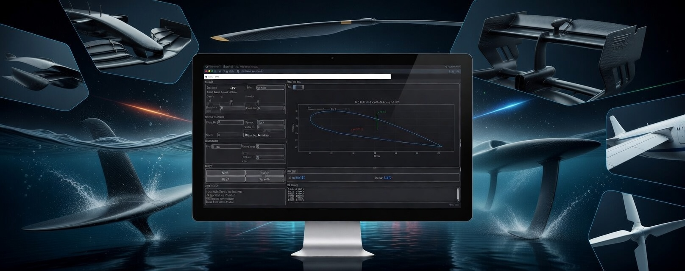

#  Manta Airfoil Tools

[](https://github.com/giuliodori/manta-airfoil-tools/releases/latest)
[](https://github.com/giuliodori/manta-airfoil-tools/actions)
[](LICENSE)
[](https://www.python.org/downloads/)
[](https://github.com/giuliodori/manta-airfoil-tools/releases/latest)
[](https://github.com/giuliodori/manta-airfoil-tools/releases)

Manta Airfoil Tools is a desktop app for creating and testing airfoil shapes (the cross-section of a wing or foil).
In one place, you can pick or generate a profile, preview it in `2D/3D`, get a quick `lift/drag` estimate, rerun a more accurate `XFOIL` simulation on the fly, and export ready-to-use files for CAD or 3D printing.
You can start from standard `NACA` codes or from a built-in library with thousands of real airfoil profiles stored in `database/airfoil.db` (geometry + aerodynamic data, performance ratings, and easy profile selection).

Repository: `manta-airfoil-tools`
Brand: `Manta Airlab`
Founder: `Fabio Giuliodori`
Open-source sponsor: [`Duilio.cc`](https://duilio.cc)



Download the latest Windows release:

```text
https://github.com/giuliodori/manta-airfoil-tools/releases/latest
```

## Why people use it

Most early airfoil work is not blocked by solver depth. It is blocked by workflow friction:

- finding the right profile
- generating clean geometry
- exporting in the format your downstream tool accepts
- getting a quick sanity check before moving on

Manta Airlab compresses that workflow into one local app with direct GUI editing and immediate geometry plus quick aerodynamic feedback (`lift`, `drag`, `Cl`, `Cd`, `Cm`, `L/D`).

## What you can do quickly

- Instant procedural NACA profile generation
- Switch source between `NACA` and `Library` profiles from local DB
- Live preview while adjusting geometry from the GUI
- Switch between `2D` and `3D` visualization of the same geometry
- Real-time response of quick aerodynamic outputs while editing
- Export to `.pts`, `.dxf`, `.stl`, and `.csv`
- Choose DXF spline or polyline output, plus `XY` or `XYZ` point formats
- Control point density and decimal precision for downstream compatibility
- Use fluid presets for air, water, salt water, or custom properties
- Run `XFOIL Simulation` from GUI to override interpolated/tabular coefficients live
- Choose from thousands of real airfoil profiles, easy to browse and compare, with geometry and aerodynamic data.


## Fastest way to try it (Windows)

1. Download `manta-airfoil-tools.exe` from the latest release.
2. Run `dist\manta-airfoil-tools.exe` if you cloned the repository.
3. Alternative from source folder: run `manta_airfoil_tools.bat`.

Unsigned executables may show a SmartScreen prompt on first launch.

## Python source (optional)

For source-based setup and troubleshooting, use the dedicated guide:

- [`docs/PYTHON_SOURCE.md`](docs/PYTHON_SOURCE.md)

## Documentation map

- CLI guide: [`docs/CLI.md`](docs/CLI.md)
- Python source setup guide: [`docs/PYTHON_SOURCE.md`](docs/PYTHON_SOURCE.md)
- Validation and benchmarks: [`docs/VALIDATION.md`](docs/VALIDATION.md)
- CAD/export compatibility and workflow notes: [`docs/CAD_EXPORTS.md`](docs/CAD_EXPORTS.md)
- NACA background and 4-digit primer: [`docs/NACA_PRIMER.md`](docs/NACA_PRIMER.md)
- Positioning and differentiators: [`docs/key_advantages.md`](docs/key_advantages.md)
- Attribution rules: [`docs/ATTRIBUTION.md`](docs/ATTRIBUTION.md)
- Third-party notices: [`docs/THIRD_PARTY_NOTICES.md`](docs/THIRD_PARTY_NOTICES.md)
- Contributing: [`docs/CONTRIBUTING.md`](docs/CONTRIBUTING.md)
- Release helper docs: [`release_tool/README.md`](release_tool/README.md)

## Credits

Manta Airlab is created and maintained by `Fabio Giuliodori`.

Preferred credit when mentioning or showcasing the project:

`Manta Airlab - Airfoil Tools by Fabio Giuliodori | Duilio.cc`

## License

This project is released under GNU General Public License v3.0 only (`GPL-3.0-only`).

Open-source sponsor: [`Duilio.cc`](https://duilio.cc)
Preferred project attribution: [`docs/ATTRIBUTION.md`](docs/ATTRIBUTION.md)
Third-party notices and attributions: [`docs/THIRD_PARTY_NOTICES.md`](docs/THIRD_PARTY_NOTICES.md)

